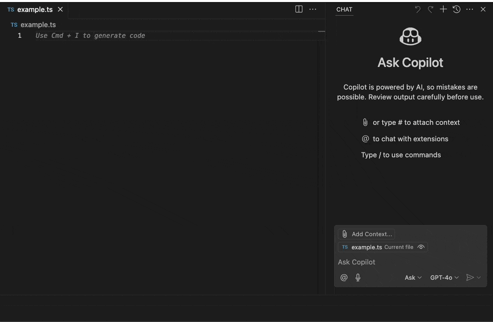

# prompt-middleware

`prompt-middleware` is a simple Visual Studio Code extension that provides a chat participant in Copilot's Ask mode. It refines a given prompt using provided context stored in `/context/context.md` within your workspace folder.



## How it works

- Open the VSCode GitHub Copilot chat interface.
- Select Ask mode.
- Type ```@refine [Your prompt that you want to refine]``` and send the message
- Click the `Copy` button and use the refined prompt wherever you want (e.g., in Edit mode).

## Why

`prompt-middleware` allows you to specify your own guidelines to refine any prompt. This is useful if you do not want to repeatedly specify your desired tone, coding style, project context, or tech stack.

## Use cases

- **Project-Specific Context**: Automatically include project-specific details like coding standards, libraries, or frameworks.
- **Team Collaboration**: Standardize prompts across a team to maintain consistency in communication with AI tools.
- **Time-Saving**: Quickly generate refined prompts without manually rewriting them every time.

## Requirements

- Ensure that the file `/context/context.md` exists in your project directory. This file should contain the guidelines to be included in the refined prompts. See the [example file](/context/context.md).

## Extension Settings

This extension does not currently contribute any settings.

## Release Notes

TBD